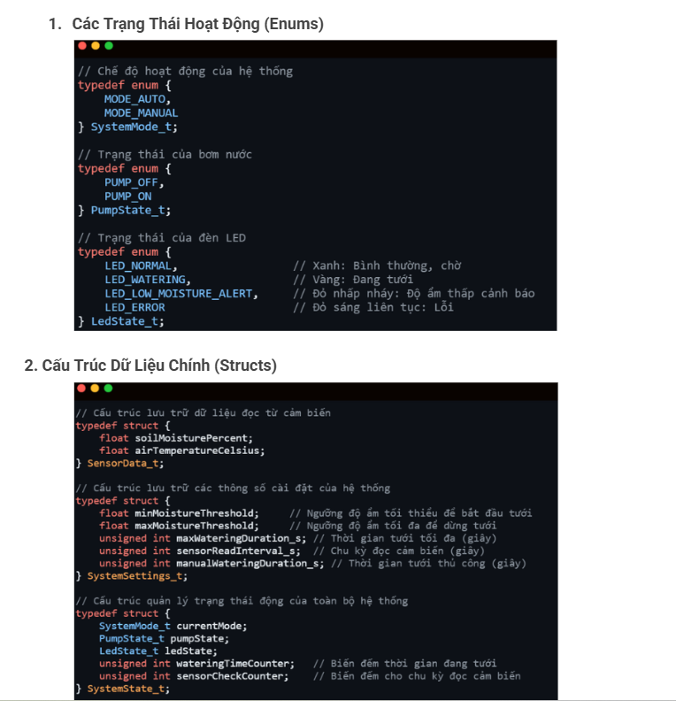

SPWS - Smart Plant Watering System (simulation)

Các file:
 - config.h
 - main.c
 - spws_controller.c/.h
 - hal_sensors.c/.h  (mô phỏng ADC)
 - hal_actuators.c/.h (mô phỏng pump+LED)
 - hal_buttons.c/.h (mô phỏng input qua stdin)
 - Makefile

Biên dịch (Linux/macOS):
    make

Chạy:
    ./spws

Điều khiển mô phỏng:
 - Gõ '1' + Enter : chuyển AUTO <-> MANUAL
 - Gõ '2' + Enter : yêu cầu tưới thủ công (chỉ hoạt động ở MODE_MANUAL)
 - Gõ 'q' + Enter : thoát chương trình

